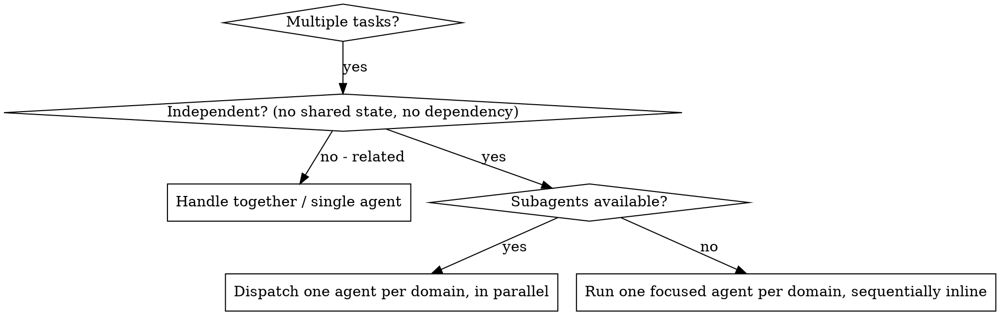

# Dispatching Parallel Agents

> Normative keywords — MUST, MUST NOT, REQUIRED, SHALL, SHALL NOT, SHOULD, SHOULD NOT, MAY — are used as defined in BCP 14 (RFC 2119, RFC 8174), and only when capitalized.

## Overview

When you face multiple unrelated problems — different test files, different subsystems, different bugs — investigating them one at a time wastes time and bloats your context. Each independent problem can be delegated to a focused agent with its own isolated context. You construct exactly the instructions and context each agent needs; agents MUST NOT inherit your session history. This keeps each agent narrowly scoped and preserves your own context for coordination.

**Iron Law: Independence before parallelism.** You MUST NOT dispatch agents in parallel until you have verified the tasks share no state and have no sequential dependency. If you cannot prove independence, you MUST treat the tasks as related and handle them together. Parallel dispatch of dependent tasks corrupts shared files, produces conflicting edits, and yields results that cannot be integrated.

**Core principle:** Dispatch one agent per independent problem domain. Run independent domains concurrently; run everything else sequentially.

## The Independence Precondition

Before dispatching anything, you MUST confirm ALL of the following hold for the candidate tasks:

1. **No shared mutable state.** No two tasks edit the same file, the same resource, the same database row, or the same configuration. If two tasks touch the same artifact, they are NOT independent.
2. **No sequential dependency.** No task needs the output, side effect, or completion of another task. If task B can only be understood or started after task A finishes, they are NOT independent.
3. **Self-contained comprehension.** Each task can be fully understood from its own scope without context from the others.
4. **No interference.** Agents running concurrently cannot collide on locks, ports, build artifacts, or generated files.

If ANY of these fails, the tasks are related. You MUST NOT parallelize them. Investigate related tasks together first — fixing one may resolve or reshape the others.

## When to Use



**You MUST use this pattern when:**
- 2+ tasks each have a distinct root cause or problem domain.
- Each task can be understood and completed without context from the others.
- No shared mutable state exists between the tasks.

**You MUST NOT use this pattern when:**
- The tasks may be related (fixing one might fix or alter another) — investigate together first.
- Understanding requires seeing the full system state at once.
- You do not yet know what is broken (exploratory debugging) — explore first, then partition.
- Tasks share state or resources and would interfere.

## Portability: Subagents and the Inline Fallback

This skill is most efficient when the host environment provides a subagent / parallel-agent capability (a tool that spawns an isolated agent with its own context). Parallelism is an optimization; it is NOT a correctness requirement.

- **If subagents are available:** You SHOULD dispatch one agent per independent domain so the domains run concurrently.
- **If subagents are NOT available in the host environment:** You MUST NOT skip or abandon the work. You MUST instead process each independent domain sequentially yourself, applying the SAME focused-task discipline to each domain one at a time — fully scoping, solving, and summarizing one domain before starting the next. The independence analysis, the focused prompt structure, the per-domain constraints, and the integration review in this skill all apply identically; only the concurrency is dropped.

Either way, the unit of work is one focused, self-contained task per independent domain.

## The Pattern

### 1. Identify Independent Domains

Partition the work by what is broken, then apply the independence precondition above. Example partition:
- Domain A: tool-approval flow.
- Domain B: batch-completion behavior.
- Domain C: abort functionality.

Each domain MUST be confirmed independent of the others before proceeding.

### 2. Construct a Focused Task per Domain

Each task — whether handed to a subagent or executed inline — MUST specify:
- **Scope:** Exactly one problem domain (one test file or one subsystem). The scope MUST be narrow enough that the agent cannot wander.
- **Goal:** A single, concrete, verifiable objective (e.g. "make these named tests pass").
- **Constraints:** Explicit boundaries on what MUST NOT be changed (e.g. "do not modify production code", "fix tests only"), so the agent cannot edit anything that another domain owns.
- **Expected output:** A required summary of root cause found and changes made.

### 3. Dispatch (or Execute Inline)

**With subagents:** Issue all independent dispatches in a single response so they run concurrently. Multiple dispatch calls in one response run in parallel; one dispatch per response runs sequentially.

```text
Agent (general-purpose): "Fix agent-tool-abort.test.ts failures"
Agent (general-purpose): "Fix batch-completion-behavior.test.ts failures"
Agent (general-purpose): "Fix tool-approval-race-conditions.test.ts failures"
# All three run concurrently.
```

**Without subagents:** Work each domain to completion in turn, using the identical focused-task definition for each, then move to the next.

You MUST NOT assign two concurrent agents any overlapping file or resource. If overlap exists, the domains were not independent — return to step 1.

### 4. Review and Integrate

After all domains complete, you MUST:
1. Read each domain's summary and confirm what changed.
2. Check for conflicts — verify no two domains edited the same code in incompatible ways.
3. Run the full verification suite (e.g. the complete test suite), not just the per-domain checks.
4. Spot-check the changes — agents can make systematic errors, and a per-domain pass does not guarantee a system-wide pass.

You MUST NOT claim the work complete until the full suite passes with all domains integrated.

## Agent Task Structure

Every focused task MUST be:
1. **Focused** — exactly one problem domain.
2. **Self-contained** — all context needed to understand and solve the problem, included in the prompt. The agent MUST NOT be expected to recover missing context from your session.
3. **Explicit about output** — state precisely what the agent must return.

A correct task prompt:

```markdown
Fix the 3 failing tests in src/agents/agent-tool-abort.test.ts:

1. "should abort tool with partial output capture" - expects 'interrupted at' in message
2. "should handle mixed completed and aborted tools" - fast tool aborted instead of completed
3. "should properly track pendingToolCount" - expects 3 results but gets 0

These appear to be timing/race-condition issues. Your task:

1. Read the test file and understand what each test verifies.
2. Identify the root cause — timing issue or actual bug?
3. Fix by:
   - Replacing arbitrary timeouts with event-based waiting.
   - Fixing bugs in the abort implementation if found.
   - Adjusting test expectations only if the tested behavior legitimately changed.

Do NOT simply increase timeouts — find the real cause.
Do NOT modify code outside this test file's subsystem.

Return: a summary of the root cause and the exact changes you made.
```

## Red Flags — STOP

If any of these is true, STOP and re-evaluate before dispatching:

| Red Flag | Why It's Wrong | Required Action |
| --- | --- | --- |
| Two tasks edit the same file or resource | Concurrent edits corrupt shared state | Treat as one domain; do not parallelize |
| One task needs another's output | Sequential dependency, not independence | Order them; run dependent task after its prerequisite |
| Scope is "fix all the tests" | Agent has no focus and will get lost | Split into one named domain per agent |
| Prompt omits the failure details | Agent cannot find the problem | Paste the exact errors, test names, and file paths |
| Prompt has no constraints | Agent may refactor unrelated code | State explicitly what MUST NOT change |
| You don't yet know what's broken | Exploratory work cannot be partitioned | Explore first, then partition |
| Output expectation is "fix it" | You cannot review or integrate blind | Require a root-cause-and-changes summary |

## Rationalizations — NOT Acceptable

| Rationalization | Reality |
| --- | --- |
| "They're probably independent, just dispatch them." | "Probably" is not proof. You MUST verify the independence precondition first. |
| "Both tasks touch the same file, but they edit different parts." | Same file = shared state = not independent. Handle as one domain. |
| "The host has no subagents, so I'll skip the parallel ones." | The work is required regardless. Run each domain sequentially inline. |
| "A broad 'fix everything' prompt saves me from writing three prompts." | Broad scope makes agents fail. One focused task per domain is REQUIRED. |
| "Each agent's tests passed, so I'm done." | Per-domain passes do not prove system-wide correctness. Run the full suite. |
| "I'll let the agent figure out the context from the repo." | Agents MUST receive self-contained prompts. Missing context produces wrong fixes. |

## Verification Checklist

Before dispatching:
- [ ] Each candidate task confirmed against the independence precondition (no shared state, no dependency, self-contained, no interference).
- [ ] Each task has narrow scope, a concrete goal, explicit constraints, and a required output format.
- [ ] No two concurrent tasks share any file or resource.

After completion:
- [ ] Each domain's summary read and understood.
- [ ] No conflicting edits across domains.
- [ ] Full verification suite run and passing with all changes integrated.
- [ ] Changes spot-checked for systematic errors.

## Key Benefits

1. **Focus** — each agent has a narrow scope and minimal context to track.
2. **Independence** — verified-independent domains cannot interfere.
3. **Speed** — where subagents exist, independent domains complete concurrently instead of one after another.
4. **Integrability** — focused tasks with explicit constraints and summaries produce changes you can review and combine cleanly.
