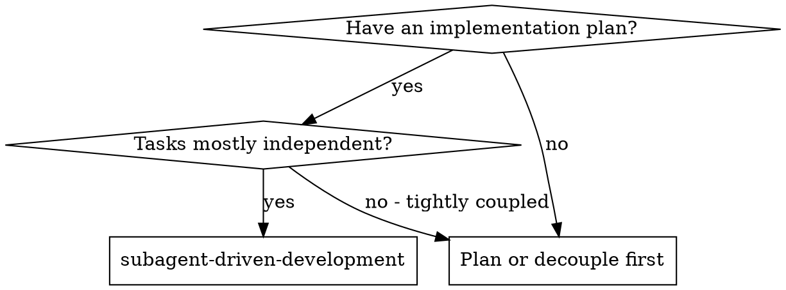
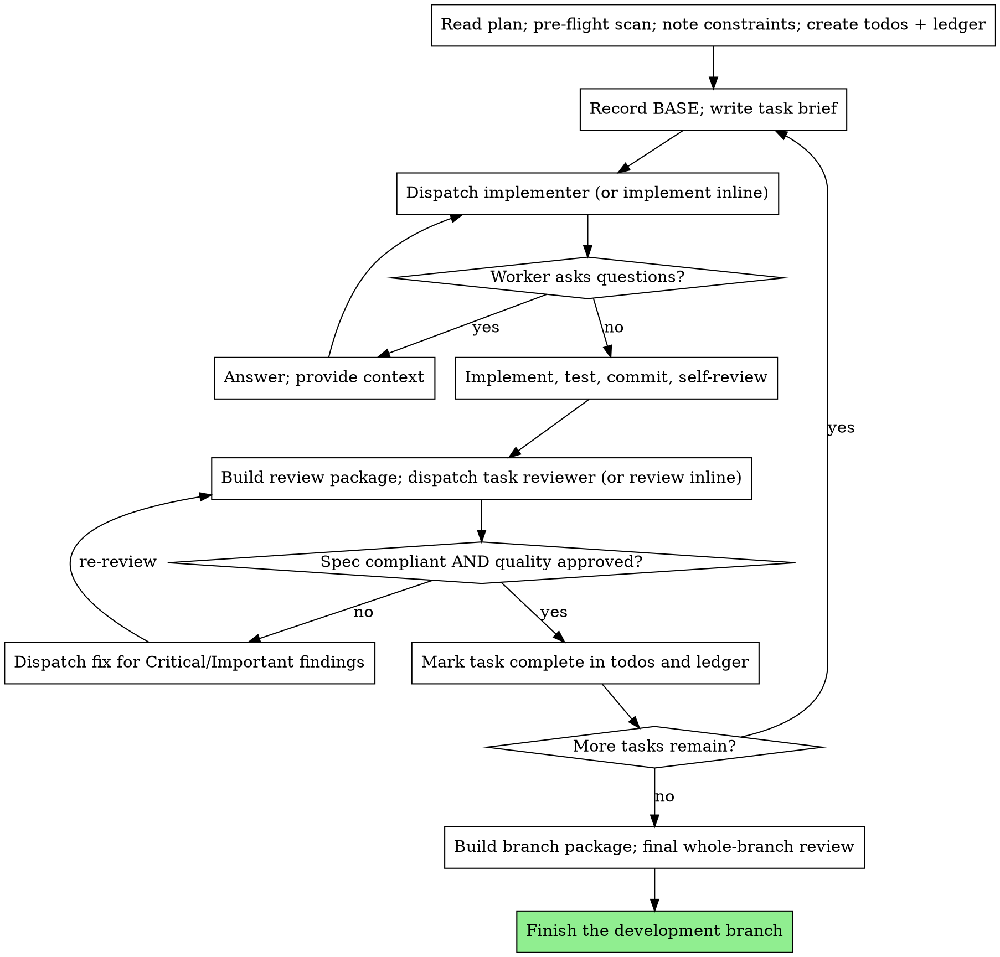

# Subagent-Driven Development

> Normative keywords — MUST, MUST NOT, REQUIRED, SHALL, SHALL NOT, SHOULD, SHOULD NOT, MAY — are used as defined in BCP 14 (RFC 2119, RFC 8174), and only when capitalized.

## Overview

Execute a plan task by task. For each task you produce a clean implementation, then a task review covering **two verdicts — spec compliance and code quality** — before any later task starts. After all tasks pass, you run one broad whole-branch review.

**Core principle:** Fresh context per task + a two-verdict review after each task + a broad final review = high quality and fast iteration. A task is not done until its review is clean.

**Execution model — subagents preferred, inline fallback REQUIRED:**

- If the host environment provides subagents (isolated-context worker agents you dispatch with a constructed prompt), you MUST run each role — implementer, task reviewer, fix, final reviewer — as a fresh subagent. A fresh subagent never inherits this session's history; you construct exactly the context it needs. This keeps each worker focused and preserves your own context for coordination.
- If the host environment does NOT provide subagents, you MUST execute the same roles **inline, one task at a time, in the same order, with the same discipline**: implement the task, then deliberately switch to a reviewer stance and review it against the brief and the diff before touching the next task. The degraded path changes the *mechanism*, never the *gates*. Every MUST below that says "dispatch X" means "dispatch X as a subagent, or perform X inline if subagents are unavailable" — the review, the verification, and the per-task gate are REQUIRED either way.

You MUST NOT skip the per-task review, collapse the two verdicts into one, or merge tasks to avoid a review, in either mode.

## The Iron Law

```
NO TASK ADVANCES UNTIL ITS REVIEW IS CLEAN
```

You MUST NOT start a later task while the current task has an unresolved Critical or Important finding, a missing verdict, or an unverified spec requirement. The review gate is the load-bearing mechanism of this skill; defeating it defeats the skill.

## When to Use



You MUST apply this skill when you have a written implementation plan whose tasks are mostly independent and you are executing it in the current session. If the tasks are tightly coupled, you MUST NOT force this skill — sequence or re-decompose the plan first, because per-task review assumes a task is reviewable on its own.

## Continuous Execution

You MUST NOT pause to check in with the user between tasks. You execute every task in the plan without stopping. The only permitted reasons to stop are:

1. A blocker you cannot resolve.
2. A genuine ambiguity or plan contradiction that prevents correct progress.
3. All tasks complete.

"Should I continue?" prompts and unsolicited progress summaries between tasks waste the user's time — they asked you to execute the plan, so you execute it. Between steps you SHOULD narrate at most one short line; the progress ledger and the review records carry the detail.

## Pre-Flight Plan Review (MANDATORY)

Before you start Task 1, you MUST scan the whole plan once for conflicts:

- Tasks that contradict each other or the plan's stated global constraints.
- Anything the plan explicitly mandates that a competent review would treat as a defect (a test that asserts nothing, verbatim duplication of a logic block).

If you find any, you MUST present them to the user as **one batched question** — each finding beside the plan text that mandates it, asking which governs — before execution begins. You MUST NOT interrupt the user once per discovery mid-plan. If the scan is clean, you proceed without comment. The per-task review loop remains the net for conflicts that only surface during implementation.

## The Workspace (host-local, REQUIRED)

All task briefs, implementer reports, review packages, and the progress ledger live in a working-tree directory inside the host project:

```
<repo-root>/.omnipowers/sdd/
```

`<repo-root>` is the host project's repository root (or your working directory if it is not a repo). You MUST create this directory if it does not exist and write a self-ignoring `.gitignore` inside it (a single line containing `*`) so the scratch artifacts stay out of `git status` and out of accidental commits. These artifacts MUST live in the working tree, not under `.git/` — `.git/` is frequently a protected path that denies agent writes, which would block an implementer from writing its report.

You MUST NOT depend on any script, tool, or service outside the host project to run this skill. The git commands and file paths below are the entire mechanism.

## File Handoffs (MANDATORY)

Everything you paste into a dispatch prompt — and everything a worker prints back — stays resident in your context for the rest of the session and is re-read on every later turn. You MUST hand large artifacts over as files, not pasted text. This holds in inline mode too: write the artifact to a file and Read it when you switch stance, rather than carrying it as inline prose.

For each task you MUST produce and reuse these files under `.omnipowers/sdd/`:

- **Task brief** — `task-<N>-brief.md`: the task's full text extracted from the plan. Produce it by reading the plan and writing only that task's section to the brief file, so the task text never has to be pasted through your context. The brief is the single source of requirements; the exact values (numbers, magic strings, signatures, test cases) appear ONLY in the brief, copied verbatim.
- **Report file** — `task-<N>-report.md`: the implementer writes its full report here and returns only a short status summary. Fix work appends its fix report (with test results) to this same file.
- **Review package** — `review-<base7>..<head7>.diff`: the task's diff as a single file the reviewer reads in one call. You MUST generate it from the BASE you recorded before the task started (see "Recording BASE"), never from `HEAD~1` — `HEAD~1` silently drops all but the last commit of a multi-commit task. Build it with:

  ```bash
  {
    echo "# Review package: BASE..HEAD"
    echo; echo "## Commits";       git log --oneline BASE..HEAD
    echo; echo "## Files changed";  git diff --stat BASE..HEAD
    echo; echo "## Diff";           git diff -U10 BASE..HEAD
  } > .omnipowers/sdd/review-<base7>..<head7>.diff
  ```

  Name the file per range so a re-review after fixes gets a distinct fresh file. The package never enters your own context; the reviewer Reads it.

A dispatch prompt describes **one task**, not the session's history. You MUST NOT paste accumulated prior-task summaries ("state after Tasks 1–3") into a later dispatch. A fresh worker needs its task brief, the interfaces it touches, and the binding constraints — nothing else.

## Recording BASE (MANDATORY)

Before you start each task, you MUST record the current commit as that task's BASE:

```bash
git rev-parse HEAD   # record this as BASE for Task N
```

You MUST use this recorded BASE — not `HEAD~1` — when you build the task's review package and when you cite the diff range to the reviewer. A multi-commit task reviewed against `HEAD~1` hides every commit but the last; that is a silent correctness hole in the review.

## The Process



You MUST NOT dispatch two implementers in parallel on the same working tree — concurrent edits conflict. Tasks run one at a time.

## Worker Status Handling (MANDATORY)

An implementer reports exactly one of four statuses. You MUST handle each:

- **DONE** — Generate the review package from the recorded BASE and dispatch the task reviewer (or review inline) with the package path, the brief, and the report.
- **DONE_WITH_CONCERNS** — The work is complete but the implementer flagged doubts. You MUST read the concerns before proceeding. If they bear on correctness or scope, you MUST address them before review. If they are observations (e.g. "this file is getting large"), note them in the ledger and proceed to review.
- **NEEDS_CONTEXT** — Information was missing. You MUST provide the missing context and re-dispatch.
- **BLOCKED** — The task cannot be completed as given. You MUST assess the blocker and act: (1) a context gap → provide more context and re-dispatch; (2) needs more reasoning → re-dispatch with a more capable model / more deliberate inline effort; (3) too large → split it into smaller pieces; (4) the plan itself is wrong → escalate to the user with the specifics.

You MUST NOT ignore an escalation, and you MUST NOT force the same model to retry the same task with no change. If a worker says it is stuck, something MUST change before the retry.

## Reviewer "⚠️ Cannot verify" Items (MANDATORY)

A task reviewer MAY report "⚠️ Cannot verify from diff" items — requirements that live in unchanged code or span tasks. These do not block the rest of the review, but you MUST resolve each one yourself before marking the task complete, because you hold the cross-task context the reviewer lacks. If you confirm an item is a real gap, you MUST treat it as a failed spec review: send it back to the implementer and re-review.

## Constructing Review Prompts (MANDATORY constraints)

Per-task reviews are task-scoped gates; the broad review happens once, at the end. When you construct a review prompt (or set your inline reviewer stance), you MUST observe all of the following:

- You MUST NOT add open-ended directives ("check all uses", "run race tests if useful") without a concrete, task-specific reason.
- You MUST NOT ask the reviewer to re-run tests the implementer already ran on the same code — the implementer's report carries the test evidence.
- You MUST NOT pre-judge findings: never instruct a reviewer to ignore an issue, not flag something, or cap a severity ("treat it as Minor at most", "the plan chose this"). If you believe a finding would be a false positive, you MUST let the reviewer raise it and adjudicate it in the loop. The presence of "do not flag", "don't treat X as a defect", "at most Minor", or "the plan chose" in a review prompt is itself a defect — it means you are pre-judging to spare yourself a loop.
- You MUST give the reviewer a **constraints block** copied verbatim from the plan's global-constraints section or the spec: exact values, exact formats, and stated relationships between components ("same layout as X", "matches Y"). This is the reviewer's attention lens; the process rules (YAGNI, test hygiene, review method) are already in the reviewer template (`@task-reviewer-prompt.md`).
- You MUST hand the reviewer its diff as the review-package file path, not as pasted diff text.
- A plan-mandated finding — or any finding that conflicts with what the plan's text requires — is the user's decision, like any plan contradiction. You MUST present the finding and the plan text and ask which governs. You MUST NOT dismiss a finding because the plan mandates it, and you MUST NOT dispatch a fix that contradicts the plan without asking.

## Fix Dispatch Rules (MANDATORY)

- You MUST dispatch a fix for every Critical and Important finding. You MUST record Minor findings in the ledger and hand that list to the final whole-branch review so it can triage which Minors must be fixed before merge. A roll-up nobody reads is a silent discard.
- Every fix carries the implementer contract: the fixer re-runs the tests covering its change and reports the command and output. You MUST name the covering test files in the fix dispatch — a one-line fix does not need the whole suite. Before you re-dispatch the reviewer, you MUST confirm the fix report contains the covering tests, the command run, and the output; only then do you re-review.
- If the **final** whole-branch review returns findings, you MUST dispatch ONE fix worker with the complete findings list, not one fixer per finding. Per-finding fixers each rebuild context and re-run suites — far more expensive for no benefit.

## Model Selection

When the host provides subagents with selectable models, you MUST specify the model explicitly on every dispatch. An omitted model silently inherits this session's model — often the most capable and most expensive — which defeats this section.

- **Mechanical implementation** (isolated function, complete spec, 1–2 files) — use a fast, cheap model. When the plan text contains the complete code to write, implementation is transcription plus testing: use the cheapest tier.
- **Integration / judgment** (multi-file coordination, pattern matching, debugging) — use a standard model.
- **Architecture / design**, and the **final whole-branch review** — use the most capable available model.
- **Reviews** — match the reviewer's model to the diff's size, complexity, and risk. A small mechanical diff does not need the most capable model; a subtle concurrency change does.

Turn count beats token price: the cheapest models routinely take 2–3× the turns on multi-step work and cost more overall. You SHOULD use a mid-tier model as the floor for reviewers and for implementers working from prose. In inline (no-subagent) mode there is no model to select — you MUST still scale your own effort the same way: minimal ceremony for transcription tasks, deliberate care for integration and design.

## Durable Progress (MANDATORY)

Conversation memory does not survive compaction. A controller that loses its place can re-dispatch entire completed task sequences — the single most expensive failure of this workflow. You MUST track progress in a ledger file, not only in todos.

- At skill start you MUST check for a ledger at `<repo-root>/.omnipowers/sdd/progress.md`. Tasks marked complete there are DONE — you MUST NOT re-dispatch them; you resume at the first task not marked complete.
- When a task's review comes back clean, you MUST append one line to the ledger in the same step as your other bookkeeping:
  `Task N: complete (commits <base7>..<head7>, review clean)`.
- The ledger is your recovery map: the commits it names exist in git even when your context no longer remembers creating them. After any compaction or resume you MUST trust the ledger and `git log` over your own recollection.
- `git clean -fdx` destroys the ledger (it is git-ignored scratch); if that happens you MUST recover the state from `git log` before dispatching anything.

## Implementer Prompt Template — `@implementer-prompt.md`

When you dispatch an implementer (or, in inline mode, when you start implementing a task), read the same-directory file `@implementer-prompt.md` and use it as the implementer's prompt — in inline mode it is your own implementation contract for the task. It is the full dispatch template (task-brief pointer, before-you-begin, the job steps, code-organization rules, over-your-head escalation, self-review, after-review, and the report contract). It is needed only at the implement step, so it is kept out of this always-loaded body.

## Task Reviewer Prompt Template — `@task-reviewer-prompt.md`

When you dispatch a task reviewer (or, in inline mode, when you switch to the reviewer stance), read the same-directory file `@task-reviewer-prompt.md` and use it as the reviewer's prompt / your reviewer stance. It is the full two-verdict review template (do-not-trust-the-report, tests, Part 1 spec compliance, Part 2 code quality, calibration, the exact output format). It is needed only at the review step, so it is kept out of this always-loaded body.

A fix dispatch MAY address spec gaps and quality findings together; the re-review after a fix MUST cover both verdicts again.

## Final Whole-Branch Review (MANDATORY)

After every task is complete and clean, you MUST run one broad review across the entire branch. You MUST build a branch-wide review package from the branch's merge base:

```bash
git merge-base <base-branch> HEAD   # = MERGE_BASE (the commit the branch started from)
{
  echo "# Branch review package: MERGE_BASE..HEAD"
  echo; echo "## Commits";      git log --oneline MERGE_BASE..HEAD
  echo; echo "## Files changed"; git diff --stat MERGE_BASE..HEAD
  echo; echo "## Diff";          git diff -U10 MERGE_BASE..HEAD
} > .omnipowers/sdd/branch-review.diff
```

Dispatch the final reviewer (most capable model, or your most deliberate inline stance) with the branch package path and the accumulated Minor-findings list from the ledger. The final reviewer evaluates the whole change for cross-task integration, contract consistency, and any defect that only emerges across tasks, and triages which Minors must be fixed before merge. Use the same review contract as `@task-reviewer-prompt.md`, with the merge-base range as the diff and "merge review" rather than "task-scoped gate" as the scope. If it returns findings, you MUST resolve them per the Fix Dispatch Rules (one fix worker, complete list) and re-review before the branch is considered done.

After the final review is clean, finish the development branch per the host project's branch-completion process (run the full test suite, ensure the working tree is clean, then merge or open the PR as the project requires).

## Red Flags — STOP

You MUST NOT:

- Start implementation on `main` / `master` without the user's explicit consent.
- Skip a task review, or accept a report missing either verdict — spec compliance AND code quality are both REQUIRED.
- Advance to the next task with an unfixed Critical or Important finding.
- Run two implementation workers in parallel on the same working tree (conflicts).
- Make a worker read the whole plan file — hand it its task brief instead.
- Omit scene-setting context — the worker MUST understand where the task fits.
- Ignore a worker's question — answer it completely before letting work proceed.
- Accept "close enough" on spec compliance — a spec issue means the task is not done.
- Skip the re-review after a fix — a fix is unverified until the reviewer re-checks it.
- Let the implementer's self-review replace the actual review — both are REQUIRED.
- Tell a reviewer what not to flag, or pre-rate a finding's severity in the prompt.
- Dispatch a task reviewer without a diff package file — generate it first.
- Re-dispatch a task the ledger already marks complete — check the ledger and `git log` after any compaction or resume.
- Paste accumulated prior-task history into a later dispatch.

## Rationalizations — rejected

| Excuse | Reality |
|--------|---------|
| "The task is tiny, skip the review" | Tiny tasks fail spec compliance too. The review is the gate; run it. |
| "Both verdicts say roughly the same thing" | Spec compliance and code quality catch different defects. Both are REQUIRED. |
| "I'll batch the reviews at the end" | A broken Task 2 poisons Task 3. You MUST review before advancing. |
| "Self-review already caught everything" | The author grading their own work is not a review. Both are needed. |
| "The plan mandates it, so it's fine" | A plan-mandated defect is the user's decision — present it, do not bury it. |
| "I'll just re-run it without changing anything" | A blocked worker re-run unchanged blocks again. Something MUST change. |
| "Pasting the prior summaries saves a step" | It bloats every later turn and re-reads on each. Hand artifacts as files. |
| "HEAD~1 is close enough for the diff" | It silently drops every commit but the last. Use the recorded BASE. |
| "No subagents here, so the gates don't apply" | The mechanism degrades; the gates do not. Review inline, same rigor. |

## Verification Checklist

You MUST be able to check every box before treating the plan as executed:

- [ ] Pre-flight plan scan run; conflicts batched to the user or scan clean
- [ ] Ledger checked at start; no completed task re-dispatched
- [ ] BASE recorded before each task; review package built from it (never `HEAD~1`)
- [ ] Each task implemented, tested, committed, and self-reviewed before its review
- [ ] Each task reviewed with BOTH verdicts; review package handed as a file
- [ ] Every Critical/Important finding fixed and re-reviewed; ⚠️ items resolved
- [ ] Each clean task appended to the ledger
- [ ] Final whole-branch review run on the merge-base range, with the Minor list
- [ ] Final findings resolved via ONE fix worker and re-reviewed
- [ ] Branch finished per the host project's completion process

If any box is unchecked, the plan is not executed — it is partially executed with an open gate, and you MUST close that gate before claiming completion.
