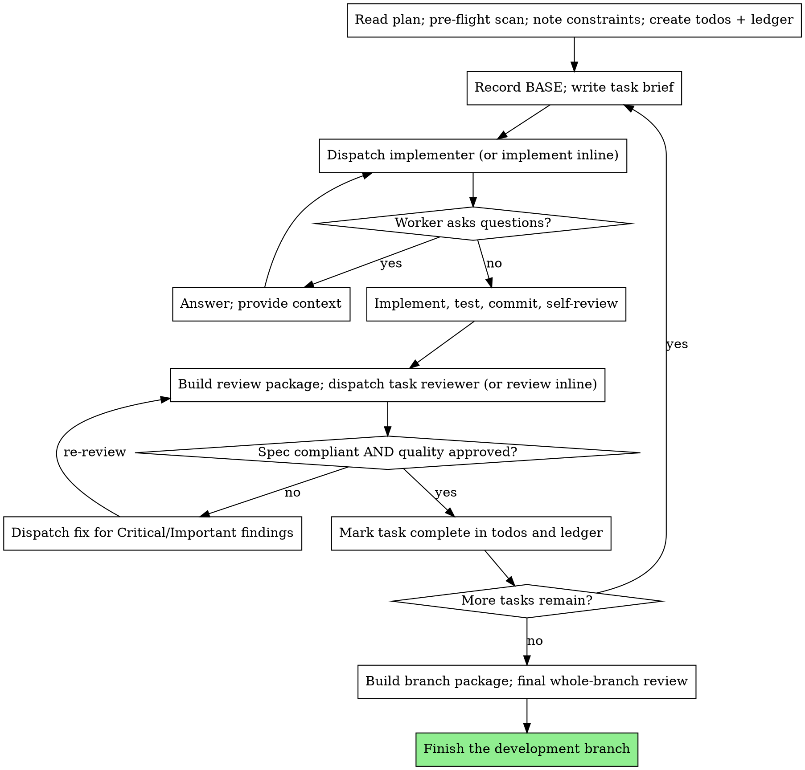

# Subagent-Driven Development

> Normative keywords — MUST, MUST NOT, REQUIRED, SHALL, SHALL NOT, SHOULD, SHOULD NOT, MAY — are used as defined in BCP 14 (RFC 2119, RFC 8174), and only when capitalized.

## Overview

- Execute the plan task by task: produce a clean implementation, then a task review carrying **two verdicts — spec compliance and code quality** — before any later task starts; after every task passes, run one broad whole-branch review.
- Host provides subagents (isolated-context worker agents you dispatch with a constructed prompt) → you MUST run each role — implementer, task reviewer, fix, final reviewer — as a fresh subagent.
- Host does NOT provide subagents → you MUST execute the same roles **inline, one task at a time, in the same order, with the same discipline**: implement the task, then deliberately switch to a reviewer stance and review it against the brief and the diff before touching the next task.
- Every "dispatch X" below means "dispatch X as a subagent, or perform X inline when subagents are unavailable". The review, the verification, and the per-task gate are REQUIRED in either mode.
- You MUST NOT skip the per-task review, collapse the two verdicts into one, or merge tasks to avoid a review, in either mode.

## The Iron Law

```
NO TASK ADVANCES UNTIL ITS REVIEW IS CLEAN
```

You MUST NOT start a later task while the current task has an unresolved Critical or Important finding, a missing verdict, or an unverified spec requirement.

## When to Use

- Written implementation plan + tasks mostly independent + executing it in the current session → you MUST apply this skill.
- No written implementation plan → plan first.
- Tasks tightly coupled → you MUST NOT force this skill; sequence or re-decompose the plan first.

## Continuous Execution

- You MUST NOT pause to check in with the user between tasks or ask "should I continue?"; execute every task in the plan without stopping.
- Only three conditions permit stopping: a blocker you cannot resolve; a genuine ambiguity or plan contradiction that prevents correct progress; all tasks complete.
- Between steps you SHOULD narrate at most one short line; unsolicited progress summaries between tasks waste the user's time, and the ledger and the review records carry the detail.

## Pre-Flight Plan Review (MANDATORY)

You wrote this plan in this session and ran the review its own skill requires → that review stands, and you MUST NOT repeat this scan. Start Task 1.

Otherwise, before you start Task 1, you MUST scan the whole plan once for:

- Tasks that contradict each other or the plan's stated global constraints.
- Anything the plan explicitly mandates that a competent review would treat as a defect.

Then:

- The scan finds anything → you MUST present them to the user as **one batched question** before execution begins, each finding beside the plan text that mandates it, asking which governs.
- You MUST NOT interrupt the user once per discovery mid-plan.
- The scan is clean → proceed without comment.

## The Workspace (host-local, REQUIRED)

All task briefs, implementer reports, review packages, and the progress ledger are **scratch** and live in a working-tree directory inside the host project:

```
<repo-root>/.omnipowers/sdd/
```

- `<repo-root>` is the host project's repository root, or your working directory when it is not a repo.
- The host declares a `scratch` location — an `Omnipowers` section in its `AGENTS.md` / `CLAUDE.md`, or in a document that file points to → you MUST use that instead, keeping the same `sdd/` layout underneath it.
- The directory does not exist → you MUST create it and write a self-ignoring `.gitignore` inside it (a single line containing `*`).
- These artifacts MUST live in the working tree, never under `.git/`.
- You MUST NOT depend on any script, tool, or service outside the host project to run this skill.

## File Handoffs (MANDATORY)

You MUST hand large artifacts over as files, not pasted text — in inline mode too: write the artifact to a file and Read it when you switch stance.

For each task you MUST produce and reuse these files under `.omnipowers/sdd/`:

- **Task brief** — `task-<N>-brief.md`: the task's full text extracted from the plan. Produce it by reading the plan and writing only that task's section to the brief file. The brief is the single source of requirements; the exact values (numbers, magic strings, signatures, test cases) appear ONLY in the brief, copied verbatim.
- **Report file** — `task-<N>-report.md`: the implementer writes its full report here and returns only a short status summary. Fix work appends its fix report (with test results) to this same file.
- **Review package** — `review-<base7>..<head7>.diff`: the task's diff as a single file the reviewer reads in one call. You MUST generate it from the BASE you recorded before the task started (see "Recording BASE"), never from `HEAD~1`. Build it with:

  ```bash
  {
    echo "# Review package: BASE..HEAD"
    echo; echo "## Commits";       git log --oneline BASE..HEAD
    echo; echo "## Files changed";  git diff --stat BASE..HEAD
    echo; echo "## Diff";           git diff -U10 BASE..HEAD
  } > .omnipowers/sdd/review-<base7>..<head7>.diff
  ```

  Name the file per range, so a re-review after fixes gets a distinct fresh file.

A dispatch prompt describes **one task**, not the session's history. You MUST NOT paste accumulated prior-task summaries ("state after Tasks 1–3") into a later dispatch. A fresh worker gets its task brief, the interfaces it touches, and the binding constraints — nothing else.

## Recording BASE (MANDATORY)

Before you start each task, you MUST record the current commit as that task's BASE:

```bash
git rev-parse HEAD   # record this as BASE for Task N
```

You MUST use this recorded BASE — not `HEAD~1` — when you build the task's review package and when you cite the diff range to the reviewer.

## The Process


```dot
digraph process {
    rankdir=TB;

    "Read plan; pre-flight scan; note constraints; create todos + ledger" [shape=box];
    "Record BASE; write task brief" [shape=box];
    "Dispatch implementer (or implement inline)" [shape=box];
    "Worker asks questions?" [shape=diamond];
    "Answer; provide context" [shape=box];
    "Implement, test, commit, self-review" [shape=box];
    "Build review package; dispatch task reviewer (or review inline)" [shape=box];
    "Spec compliant AND quality approved?" [shape=diamond];
    "Dispatch fix for Critical/Important findings" [shape=box];
    "Mark task complete in todos and ledger" [shape=box];
    "More tasks remain?" [shape=diamond];
    "Build branch package; final whole-branch review" [shape=box];
    "Finish the development branch" [shape=box style=filled fillcolor=lightgreen];

    "Read plan; pre-flight scan; note constraints; create todos + ledger" -> "Record BASE; write task brief";
    "Record BASE; write task brief" -> "Dispatch implementer (or implement inline)";
    "Dispatch implementer (or implement inline)" -> "Worker asks questions?";
    "Worker asks questions?" -> "Answer; provide context" [label="yes"];
    "Answer; provide context" -> "Dispatch implementer (or implement inline)";
    "Worker asks questions?" -> "Implement, test, commit, self-review" [label="no"];
    "Implement, test, commit, self-review" -> "Build review package; dispatch task reviewer (or review inline)";
    "Build review package; dispatch task reviewer (or review inline)" -> "Spec compliant AND quality approved?";
    "Spec compliant AND quality approved?" -> "Dispatch fix for Critical/Important findings" [label="no"];
    "Dispatch fix for Critical/Important findings" -> "Build review package; dispatch task reviewer (or review inline)" [label="re-review"];
    "Spec compliant AND quality approved?" -> "Mark task complete in todos and ledger" [label="yes"];
    "Mark task complete in todos and ledger" -> "More tasks remain?";
    "More tasks remain?" -> "Record BASE; write task brief" [label="yes"];
    "More tasks remain?" -> "Build branch package; final whole-branch review" [label="no"];
    "Build branch package; final whole-branch review" -> "Finish the development branch";
}
```

You MUST NOT dispatch two implementers in parallel on the same working tree; tasks run one at a time.

## Worker Status Handling (MANDATORY)

An implementer reports exactly one of four statuses. You MUST handle each:

- **DONE** → generate the review package from the recorded BASE and dispatch the task reviewer with the package path, the brief, and the report.
- **DONE_WITH_CONCERNS** → you MUST read the concerns before proceeding. They bear on correctness or scope → you MUST address them before review. They are observations → note them in the ledger and proceed to review.
- **NEEDS_CONTEXT** → you MUST provide the missing context and re-dispatch.
- **BLOCKED** → you MUST assess the blocker and act: (1) a context gap → provide more context and re-dispatch; (2) needs more reasoning → re-dispatch with a more capable model / more deliberate inline effort; (3) too large → split it into smaller pieces; (4) the plan itself is wrong → escalate to the user with the specifics.

You MUST NOT ignore an escalation, and you MUST NOT force the same model to retry the same task with no change. A worker says it is stuck → something MUST change before the retry.

## Reviewer "⚠️ Cannot verify" Items (MANDATORY)

- A task reviewer MAY report "⚠️ Cannot verify from diff" items — requirements that live in unchanged code or span tasks. They do not block the rest of the review.
- You MUST resolve each one yourself before marking the task complete.
- You confirm an item is a real gap → you MUST treat it as a failed spec review: send it back to the implementer and re-review.

## Constructing Review Prompts (MANDATORY constraints)

Per-task reviews are task-scoped gates; the broad review runs once, at the end. When you construct a review prompt, or set your inline reviewer stance, you MUST observe all of the following:

- You MUST NOT add open-ended directives without a concrete, task-specific reason.
- You MUST NOT ask the reviewer to re-run tests the implementer already ran on the same code.
- You MUST NOT pre-judge findings: never instruct a reviewer to ignore an issue, not flag something, or cap a severity. You believe a finding would be a false positive → you MUST let the reviewer raise it and adjudicate it in the loop.
- You MUST give the reviewer a **constraints block** copied verbatim from the plan's global-constraints section or the spec: exact values, exact formats, and stated relationships between components.
- You MUST hand the reviewer its diff as the review-package file path, not as pasted diff text.
- A plan-mandated finding, or any finding that conflicts with what the plan's text requires, is the user's decision → you MUST present the finding and the plan text and ask which governs. You MUST NOT dismiss a finding because the plan mandates it, and you MUST NOT dispatch a fix that contradicts the plan without asking.

## Fix Dispatch Rules (MANDATORY)

- You MUST dispatch a fix for every Critical and Important finding.
- You MUST record Minor findings in the ledger and hand that list to the final whole-branch review to triage which Minors must be fixed before merge.
- Every fix carries the implementer contract: the fixer re-runs the tests covering its change and reports the command and output. You MUST name the covering test files in the fix dispatch.
- Before you re-dispatch the reviewer, you MUST confirm the fix report contains the covering tests, the command run, and the output; only then do you re-review.
- A fix landed → you MUST re-review the task before it advances; you MUST NOT accept a fix on the fixer's report alone.
- The **final** whole-branch review returns findings → you MUST dispatch ONE fix worker with the complete findings list, not one fixer per finding.

## Model Selection

The host provides subagents with selectable models → you MUST specify the model explicitly on every dispatch.

- **Mechanical implementation** (isolated function, complete spec, 1–2 files) — use a fast, cheap model. The plan text contains the complete code to write → use the cheapest tier.
- **Integration / judgment** (multi-file coordination, pattern matching, debugging) — use a standard model.
- **Architecture / design**, and the **final whole-branch review** — use the most capable available model.
- **Reviews** — match the reviewer's model to the diff's size, complexity, and risk.
- You SHOULD use a mid-tier model as the floor for reviewers and for implementers working from prose.
- Inline (no-subagent) mode has no model to select → you MUST still scale your own effort the same way: minimal ceremony for transcription tasks, deliberate care for integration and design.

## Durable Progress (MANDATORY)

You MUST track progress in a ledger file, not only in todos.

- At skill start you MUST check for a ledger at `<repo-root>/.omnipowers/sdd/progress.md`. Tasks marked complete there are DONE — you MUST NOT re-dispatch them; you resume at the first task not marked complete.
- A task's review comes back clean → you MUST append one line to the ledger in the same step as your other bookkeeping:
  `Task N: complete (commits <base7>..<head7>, review clean)`.
- After any compaction or resume you MUST trust the ledger and `git log` over your own recollection.
- `git clean -fdx` destroyed the ledger → you MUST recover the state from `git log` before dispatching anything.
- The ledger is a cache, not the project's record of progress. The host keeps its own work-state document — its `Omnipowers` declaration names it under `work-state`, or the project plainly records progress, blockers, and the next action somewhere → you MUST update that document as each task completes, and it is authoritative if the two ever disagree.

## Implementer Prompt Template — `@implementer-prompt.md`

You dispatch an implementer, or in inline mode start implementing a task → read the same-directory file `@implementer-prompt.md` and use it as the implementer's prompt, or as your own implementation contract for the task.

## Task Reviewer Prompt Template — `@task-reviewer-prompt.md`

You dispatch a task reviewer, or in inline mode switch to the reviewer stance → read the same-directory file `@task-reviewer-prompt.md` and use it as the reviewer's prompt, or as your reviewer stance.

A fix dispatch MAY address spec gaps and quality findings together; the re-review after a fix MUST cover both verdicts again.

## Final Whole-Branch Review (MANDATORY)

Every task is complete and clean → you MUST run one broad review across the entire branch. You MUST build a branch-wide review package from the branch's merge base:

```bash
git merge-base <base-branch> HEAD   # = MERGE_BASE (the commit the branch started from)
{
  echo "# Branch review package: MERGE_BASE..HEAD"
  echo; echo "## Commits";      git log --oneline MERGE_BASE..HEAD
  echo; echo "## Files changed"; git diff --stat MERGE_BASE..HEAD
  echo; echo "## Diff";          git diff -U10 MERGE_BASE..HEAD
} > .omnipowers/sdd/branch-review.diff
```

- Dispatch the final reviewer (most capable model, or your most deliberate inline stance) with the branch package path and the accumulated Minor-findings list from the ledger.
- Direct it to evaluate the whole change for cross-task integration, contract consistency, and any defect that only emerges across tasks, and to triage which Minors must be fixed before merge.
- Use the same review contract as `@task-reviewer-prompt.md`, with the merge-base range as the diff and "merge review" rather than "task-scoped gate" as the scope.
- It returns findings → you MUST resolve them per the Fix Dispatch Rules (one fix worker, complete list) and re-review before the branch is considered done.
- The final review is clean → finish the development branch per the host project's branch-completion process: run the full test suite, ensure the working tree is clean, then merge or open the PR as the project requires.

## Red Flags — STOP

You MUST NOT:

- Start implementation on `main` / `master` without the user's explicit consent.
- Make a worker read the whole plan file — hand it its task brief instead.
- Omit scene-setting context — the worker MUST understand where the task fits.
- Ignore a worker's question — answer it completely before letting work proceed.
- Accept "close enough" on spec compliance — a spec issue means the task is not done.
- Let the implementer's self-review replace the task review — both are REQUIRED.

## Rationalizations — rejected

| Thought | What to do instead |
|--------|---------|
| "The task is tiny, skip the review" | Run the review; task size grants no exemption. |
| "Both verdicts say roughly the same thing" | Produce both verdicts; each catches defects the other misses. |
| "I'll batch the reviews at the end" | Review each task before advancing to the next. |
| "Self-review already caught everything" | Run the task review as well. |
| "The plan mandates it, so it's fine" | Present the finding and the plan text to the user. |
| "I'll just re-run it without changing anything" | Change something before the retry. |
| "Pasting the prior summaries saves a step" | Hand artifacts over as files. |
| "HEAD~1 is close enough for the diff" | Use the recorded BASE. |
| "No subagents here, so the gates don't apply" | Run every gate inline, same rigor. |

## Verification Checklist

You MUST be able to check every box before treating the plan as executed:

- [ ] Pre-flight plan scan run; conflicts batched to the user or scan clean
- [ ] Ledger checked at start; no completed task re-dispatched
- [ ] BASE recorded before each task; review package built from it (never `HEAD~1`)
- [ ] Each task implemented, tested, committed, and self-reviewed before its review
- [ ] Each task reviewed with BOTH verdicts; review package handed as a file
- [ ] Every Critical/Important finding fixed and re-reviewed; ⚠️ items resolved
- [ ] Each clean task appended to the ledger
- [ ] Final whole-branch review run on the merge-base range, with the Minor list
- [ ] Final findings resolved via ONE fix worker and re-reviewed
- [ ] Branch finished per the host project's completion process

Any box is unchecked → you MUST close that gate before claiming completion.
