# Test-Driven Bug Fixing

> Normative keywords — MUST, MUST NOT, REQUIRED, SHALL, SHALL NOT, SHOULD, SHOULD NOT, RECOMMENDED, MAY, OPTIONAL — are used as defined in BCP 14 (RFC 2119, RFC 8174), and only when capitalized.

## Overview

You MUST reproduce the bug with a failing test before you change any production code. You MUST watch that test fail for the bug's reason. Only then MAY you write the fix.

**Core principle:** If you did not watch a test fail by reproducing the bug, you have not found the bug — and you cannot know your fix works.

A bug fix without a regression test is not a fix. It is an unverified guess, and it WILL regress.

## When to Use

You MUST apply this skill whenever you fix a defect in existing behavior:
- A reported bug
- A crash, exception, or wrong output
- A regression
- A "works on my machine" investigation

This skill governs **fixing defects**, not building new behavior. If nothing is broken — you are adding a capability, not correcting wrong behavior — this skill does not apply, and you MUST NOT stretch it to cover feature work.

You MUST NOT downgrade a bug fix to "just a quick change" to avoid this skill. "It's obvious" and "it's one line" are not exceptions (see The Iron Law).

## The Iron Law

```
NO BUG FIX WITHOUT A FAILING TEST THAT REPRODUCES THE BUG FIRST
```

You MUST NOT modify production code to fix a bug until a test reproduces that bug and fails.

If you wrote the fix before the test, you MUST revert it, reproduce the bug with a failing test, then re-apply the fix. Specifically:
- You MUST NOT keep the fix staged or commented out "for reference" while writing the test.
- You MUST NOT write a test that passes against the buggy code and call it a regression test — a test that never failed proves nothing.

## Reproduce → Fix → Harden

```dot
digraph bugfix_cycle {
    rankdir=LR;
    repro [label="REPRODUCE\nFailing test that\ntriggers the bug", shape=box, style=filled, fillcolor="#ffcccc"];
    verify_red [label="Verify it fails\nfor the bug's reason", shape=diamond];
    fix [label="FIX\nMinimal change\nat the root cause", shape=box, style=filled, fillcolor="#ccffcc"];
    verify_green [label="Verify it passes\nAll green", shape=diamond];
    harden [label="HARDEN\nEdge cases of\nthe same defect", shape=box, style=filled, fillcolor="#ccccff"];

    repro -> verify_red;
    verify_red -> fix [label="reproduces\nthe bug"];
    verify_red -> repro [label="wrong\nfailure"];
    fix -> verify_green;
    verify_green -> harden [label="yes"];
    verify_green -> fix [label="no"];
    harden -> verify_green [label="stay green"];
}
```



### REPRODUCE — Write a Failing Test That Triggers the Bug

You MUST reconstruct the triggering input and state in the test fixture, and you MUST assert the *correct* behavior (what should happen) — never the buggy behavior.

<Good>
```typescript
test('rejects a withdrawal that overdraws the account', async () => {
  const account = new Account({ balance: 100 });
  await expect(account.withdraw(150)).rejects.toThrow('Insufficient funds');
  expect(account.balance).toBe(100); // unchanged
});
```
Reconstructs the exact state, asserts the correct behavior, names the bug
</Good>

<Bad>
```typescript
test('withdraw works', async () => {
  const account = new Account({ balance: 100 });
  await account.withdraw(50);
  expect(account.balance).toBe(50);
});
```
Tests the happy path that already worked — does not reproduce the bug
</Bad>

**Requirements:**
- You MUST reconstruct the data and state that triggered the bug.
- You MUST assert the exact behavior the bug report names — the specific value, error message, status, or count it specifies (e.g. returns `[3,4,5]`, rejects with `'Email required'`, throws `'Insufficient funds'`, stops after 3 attempts) — not a vague "it works".
- Each test MUST cover one defect and MUST be named after the bug.

### Verify It Fails — For the Bug's Reason

This step is REQUIRED. You MUST NOT skip it.

The commands and code in this skill use npm/Jest/TypeScript only as an example. The reproduce → fail → fix → pass discipline is language-agnostic: you MUST run the bug fix through the host project's own test runner, following its test-file conventions — not literally `npm test` unless that is the host's runner.

```bash
npm test path/to/test.test.ts
```

You MUST confirm:
- The test **fails** (it does not merely error out)
- It fails **the way the bug manifests** (the wrong output, the missing error, the crash)
- It fails because of the defect — not because of a typo or a wrong import

If the test passes, it does NOT reproduce the bug; you MUST fix the test until it does.

If the failure differs from the bug, you have NOT reproduced this bug yet; you MUST keep working.

### FIX — Minimal Change at the Root Cause

You MUST locate the root cause and fix the cause. You MUST NOT patch the symptom.

<Good>
```typescript
withdraw(amount: number) {
  if (amount > this.balance) throw new Error('Insufficient funds');
  this.balance -= amount;
}
```
Adds the missing guard — the actual cause
</Good>

<Bad>
```typescript
withdraw(amount: number) {
  this.balance -= amount;
  if (this.balance < 0) this.balance = 0; // patches the symptom
}
```
Hides the symptom; the invalid withdrawal still "succeeds"
</Bad>

You MUST make the minimal change. In the same change you MUST NOT refactor unrelated code, add features, or fix unrelated bugs.

You MUST apply the fix to the host project's actual production implementation — the code that ships and that your reproducing test exercises. If you cannot locate that implementation, you MUST keep searching for it; you MUST NOT substitute a standalone "corrected" function, a snippet, or sample code as the fix. A correction that does not change the code under test changes nothing.

### Verify It Passes

This step is REQUIRED.

```bash
npm test path/to/test.test.ts
```

You MUST confirm:
- The reproducing test now **passes**
- **All other tests still pass** — your fix MUST NOT break them
- Output is pristine — no new errors or warnings

If the reproducing test still fails, you MUST fix the code, not the test.

If other tests broke, your fix has side effects; you MUST address them now.

### HARDEN — Cover the Defect Class

After the suite is green:
- You SHOULD add tests for adjacent cases of the same defect (boundary, null, zero, concurrent) wherever they could plausibly fail.
- You MAY clean up the fix (names, duplication).
- You MUST keep every test green; refactoring MUST NOT change behavior.

## Find the Root Cause First

The reproducing test tells you *that* the bug exists. Before fixing, you MUST locate *why*:

- You MUST trace from the failing assertion to the line that produces the wrong result.
- You MUST fix at the level where the cause lives, not where the symptom surfaces — a fix at the wrong level moves the bug, it does not remove it.

If the root cause is unknown, you MUST keep investigating. You MUST NOT patch a symptom you do not understand.

## When the Regression Test Is Hard to Write

A test that is painful to write is usually telling you something about the *code*, not just the test. Before you fight the test, read the signal:

| Friction | What it signals | What to do |
|---|---|---|
| The test needs elaborate setup | The unit does too much / is too coupled | Extract helpers; consider splitting the unit. |
| You must mock almost everything | The code depends on concretes, not interfaces | Inject the dependency instead of reaching for it. |
| You cannot isolate the bug in a test | The responsibility is smeared across layers | Narrow the seam; test at the level the defect lives. |

This does not waive the Iron Law — you still write the reproducing test. It tells you the fix may need a small structural change so that test (and the next one) is writable at all.

## The Only Exception — When You Cannot Reproduce It

The reproducing test is REQUIRED. You MAY skip it ONLY when reproduction is genuinely impossible after real effort. When — and only when — that is the case, you MUST do all of the following before treating the fix as done:

1. You MUST summarize the complete reasons reproduction is impossible.
2. You MUST obtain the user's explicit permission to proceed without a reproducing test.
3. You MUST add a comment in the relevant production code recording that no regression test exists and why.

You MUST NOT skip the reproducing test for any other reason — not because the fix is "obvious", "too small", urgent, or because no tests exist nearby. "Hard to reproduce" is not "impossible to reproduce": if you have not exhausted real effort, a reproducing test is still REQUIRED.

## Rationalizations — STOP

Each of these thoughts means you are about to violate the Iron Law. Each is rejected:

| Excuse | Reality |
|--------|---------|
| "The fix is obvious, skip the test" | Obvious fixes are wrong more often than you think. The test costs 30 seconds and stops the regression. You MUST still write it. |
| "I already reproduced it manually" | Manual repro is not re-runnable. The next change silently brings the bug back. A test is REQUIRED. |
| "I can see the cause, just patch it" | Without a failing test you cannot prove the patch addresses *this* bug. |
| "I'll add the regression test after" | A test written after the fix passes immediately — it never proved it catches the bug. |
| "It's a one-line fix" | One-line fixes regress like any other. You MUST guard it. |
| "Hard to reproduce in a test" | Hard is not impossible. Keep investigating; you MUST NOT guess. |
| "The bug is in third-party code" | Test your usage. You MUST pin the behavior you depend on so it cannot drift. |
| "No tests exist here" | You are fixing this file — you MUST start the safety net now, with this bug. |
| "I can't find the implementation, here's a corrected version" | A fix not applied to the host code fixes nothing — your test still fails against the real code. Locate the real implementation; a standalone snippet is not a fix. |

## Red Flags — STOP and Start Over

If any of these is true, you MUST revert the fix, reproduce with a failing test, then fix:

- Fix written before a reproducing test
- The "regression test" passes against the buggy code
- You cannot reproduce the bug but are "pretty sure" the fix is right (and have not met the "Only Exception" bar)
- The regression test was added after the fix
- The symptom is patched without locating the cause
- A standalone "corrected" function or snippet submitted as the fix instead of a patch to the real implementation (because it was not located)
- A speculative fix for a bug you cannot trigger
- "This bug is different because..."

## Example

**Bug:** Submitting a form with an empty email is accepted; it should be rejected.

**REPRODUCE**
```typescript
test('rejects an empty email on submit', async () => {
  const result = await submitForm({ email: '' });
  expect(result.error).toBe('Email required');
});
```

**Verify it fails — for the bug's reason**
```bash
$ npm test
FAIL: expected 'Email required', got undefined
```
The missing validation is exactly the bug.

**FIX (root cause: no guard)**
```typescript
function submitForm(data: FormData) {
  if (!data.email?.trim()) {
    return { error: 'Email required' };
  }
  // ...
}
```

**Verify it passes**
```bash
$ npm test
PASS
```

**HARDEN**
Add cases for whitespace-only and malformed emails around the same validation.

## Verification Checklist

You MUST be able to check every box before calling the bug fixed:

- [ ] Reproduced the bug with a test that failed first
- [ ] The test failed the way the bug manifests (right reason)
- [ ] Located the root cause; fixed the cause, not the symptom
- [ ] Made the minimal fix (no unrelated changes)
- [ ] The reproducing test now passes
- [ ] All other tests still pass; output pristine
- [ ] The regression test remains in the suite
- [ ] Adjacent cases of the same defect are covered, or their absence is justified

If you cannot check every box, the bug is not fixed — it is hidden, and you MUST start over. The only permitted gap is a missing reproducing test under the "Only Exception" conditions above.

## Testing Anti-Patterns

When you write the regression test or add mocks, you MUST read @testing-anti-patterns.md and avoid:
- Testing mock behavior instead of real behavior
- Adding test-only methods to production classes
- Mocking without understanding dependencies

## Final Rule

```
Bug fixed → a test reproduced it (failed first) and now guards it
Otherwise → not fixed, just hidden
```

You MAY ship a fix without a reproducing regression test ONLY under the "Only Exception" conditions: the complete reasons summarized, the user's explicit permission obtained, and an explanatory comment added in the code.
