# Test-Driven Bug Fixing

## Overview

Reproduce the bug with a failing test first. Watch it fail for the right reason. Then fix it. Watch the test pass.

**Core principle:** If you didn't watch a test fail by reproducing the bug, you don't know you found the bug — or that your fix works.

A bug fix without a regression test isn't fixed. It's unverified, and it comes back.

**Violating the letter of the rules is violating the spirit of the rules.**

## When to Use

**Always, when fixing a defect in existing behavior:**
- A reported bug
- A crash, exception, or wrong output
- A regression
- A "works on my machine" investigation

**This skill is for fixing defects, not building new behavior.** If nothing is broken — you're adding a capability, not correcting wrong behavior — this skill does not apply.

**Exception (ask first):**
- A bug that genuinely cannot be reproduced in a test (see "When You Can't Reproduce It")

Thinking "this fix is obvious, skip the test"? Stop. That's the rationalization that lets the bug return.

## The Iron Law

```
NO BUG FIX WITHOUT A FAILING TEST THAT REPRODUCES THE BUG FIRST
```

Already wrote the fix? Revert it. Reproduce the bug with a test, watch it fail, then re-apply the fix.

**No exceptions:**
- Don't keep the fix "staged" while you write the test
- Don't write a test that passes against the buggy code and call it done
- A test that never failed proves nothing

## Reproduce → Fix → Harden

```dot
digraph bugfix_cycle {
    rankdir=LR;
    repro [label="REPRODUCE\nFailing test that\ntriggers the bug", shape=box, style=filled, fillcolor="#ffcccc"];
    verify_red [label="Verify it fails\nfor the bug's reason", shape=diamond];
    fix [label="FIX\nMinimal change\nat the root cause", shape=box, style=filled, fillcolor="#ccffcc"];
    verify_green [label="Verify it passes\nAll green", shape=diamond];
    harden [label="HARDEN\nEdge cases of\nthe same defect", shape=box, style=filled, fillcolor="#ccccff"];

    repro -> verify_red;
    verify_red -> fix [label="reproduces\nthe bug"];
    verify_red -> repro [label="wrong\nfailure"];
    fix -> verify_green;
    verify_green -> harden [label="yes"];
    verify_green -> fix [label="no"];
    harden -> verify_green [label="stay green"];
}
```



### REPRODUCE — Write a Failing Test That Triggers the Bug

Reconstruct the triggering input and state in the test fixture, then assert the *correct* behavior.

<Good>
```typescript
test('rejects a withdrawal that overdraws the account', async () => {
  const account = new Account({ balance: 100 });
  await expect(account.withdraw(150)).rejects.toThrow('Insufficient funds');
  expect(account.balance).toBe(100); // unchanged
});
```
Reconstructs the exact state, asserts the correct behavior, names the bug
</Good>

<Bad>
```typescript
test('withdraw works', async () => {
  const account = new Account({ balance: 100 });
  await account.withdraw(50);
  expect(account.balance).toBe(50);
});
```
Tests the happy path that already worked — does not reproduce the bug
</Bad>

**Requirements:**
- Reconstruct the data and state that triggered the bug
- Assert the correct behavior (what *should* happen)
- One defect per test, named after the bug

### Verify It Fails — For the Bug's Reason

**MANDATORY. Never skip.**

```bash
npm test path/to/test.test.ts
```

Confirm:
- The test **fails** (not errors out)
- It fails **the way the bug manifests** (the wrong output, the missing error, the crash)
- It fails because of the defect — not a typo or a wrong import

**Test passes?** It doesn't reproduce the bug. You're testing behavior that already works. Fix the test until it reproduces the defect.

**Different failure than the bug?** You haven't reproduced *this* bug yet. Keep going.

### FIX — Minimal Change at the Root Cause

Find the root cause, then make the smallest change that fixes the cause — not the symptom.

<Good>
```typescript
withdraw(amount: number) {
  if (amount > this.balance) throw new Error('Insufficient funds');
  this.balance -= amount;
}
```
Adds the missing guard — the actual cause
</Good>

<Bad>
```typescript
withdraw(amount: number) {
  this.balance -= amount;
  if (this.balance < 0) this.balance = 0; // patches the symptom
}
```
Hides the symptom; the invalid withdrawal still "succeeds"
</Bad>

Don't refactor unrelated code, add features, or fix other bugs in the same change.

### Verify It Passes

**MANDATORY.**

```bash
npm test path/to/test.test.ts
```

Confirm:
- The reproducing test now **passes**
- **All other tests still pass** (your fix didn't break anything)
- Output pristine — no new errors or warnings

**Reproducing test still fails?** Fix the code, not the test.

**Other tests broke?** Your fix has side effects. Address them now.

### HARDEN — Cover the Defect Class

After green:
- Add tests for adjacent cases of the same defect (boundary, null, zero, concurrent)
- Clean up the fix; keep names clear
- Keep every test green; don't add new behavior

## Find the Root Cause First

The reproducing test tells you *that* the bug exists. Before fixing, locate *why*:

- Trace from the failing assertion to the line that produces the wrong result
- Fix at the level where the cause lives, not where the symptom surfaces
- A fix at the wrong level moves the bug instead of removing it

If the cause is still unknown, keep investigating. Don't patch a symptom you don't understand.

## When You Can't Reproduce It

If you cannot reproduce the bug in a test:

- **You don't fully understand it yet.** A bug you can't trigger on demand is a bug you can't prove you fixed.
- **Do not ship a speculative fix.** Keep investigating — add logging, narrow the inputs, reconstruct the environment — or escalate and ask for help.
- A fix for an unreproduced bug is a guess. Guesses regress.

Only when reproduction is genuinely impossible after real effort: say so explicitly, explain why, and get the user's agreement before treating the fix as done.

## Rationalizations — STOP

| Excuse | Reality |
|--------|---------|
| "The fix is obvious, skip the test" | Obvious fixes are wrong more often than you think. The test costs 30 seconds and stops the regression. |
| "I already reproduced it manually" | Manual repro isn't re-runnable. The next change silently brings the bug back. |
| "I can see the cause, just patch it" | Without a failing test you can't prove the patch addresses *this* bug. |
| "I'll add the regression test after" | A test written after the fix passes immediately — it never proved it catches the bug. |
| "It's a one-line fix" | One-line fixes cause regressions like any other. Guard it. |
| "Hard to reproduce in a test" | Then you don't understand it yet. Keep investigating; don't guess. |
| "The bug is in third-party code" | Test your usage. Pin the behavior you depend on so it can't drift. |
| "No tests exist here" | You're fixing this file — start the safety net now, with this bug. |

## Red Flags — STOP and Start Over

- Fix written before a reproducing test
- The "regression test" passes against the buggy code
- Can't reproduce the bug in a test but "pretty sure" the fix is right
- Regression test added "later", after the fix
- Patching the symptom without locating the cause
- A speculative fix for a bug you can't trigger
- "This bug is different because..."

**All of these mean: revert the fix, reproduce with a failing test, then fix.**

## Example

**Bug:** Submitting a form with an empty email is accepted; it should be rejected.

**REPRODUCE**
```typescript
test('rejects an empty email on submit', async () => {
  const result = await submitForm({ email: '' });
  expect(result.error).toBe('Email required');
});
```

**Verify it fails — for the bug's reason**
```bash
$ npm test
FAIL: expected 'Email required', got undefined
```
The missing validation is exactly the bug.

**FIX (root cause: no guard)**
```typescript
function submitForm(data: FormData) {
  if (!data.email?.trim()) {
    return { error: 'Email required' };
  }
  // ...
}
```

**Verify it passes**
```bash
$ npm test
PASS
```

**HARDEN**
Add cases for whitespace-only and malformed emails around the same validation.

## Verification Checklist

Before calling the bug fixed:

- [ ] Reproduced the bug with a test that failed first
- [ ] The test failed the way the bug manifests (right reason)
- [ ] Located the root cause; fixed the cause, not the symptom
- [ ] Made the minimal fix (no unrelated changes)
- [ ] The reproducing test now passes
- [ ] All other tests still pass; output pristine
- [ ] The regression test stays in the suite
- [ ] Adjacent cases of the same defect are covered

Can't check every box? The bug isn't fixed — it's hidden. Start over.

## Testing Anti-Patterns

When writing the regression test or adding mocks, read @testing-anti-patterns.md to avoid:
- Testing mock behavior instead of real behavior
- Adding test-only methods to production classes
- Mocking without understanding dependencies

## Final Rule

```
Bug fixed → a test reproduced it (failed first) and now guards it
Otherwise → not fixed, just hidden
```

Ship a fix without a reproducing regression test only with the user's explicit agreement.
