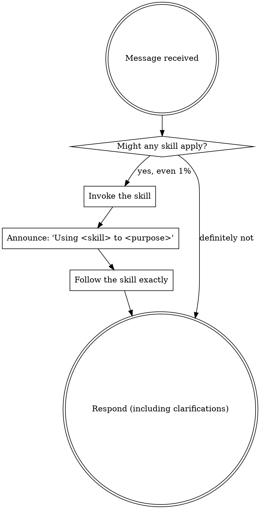

> Normative keywords — MUST, MUST NOT, REQUIRED, SHOULD, SHOULD NOT, MAY — are used as defined in BCP 14 (RFC 2119, RFC 8174), and only when capitalized.

<SUBAGENT-STOP>
If you were dispatched as a subagent to execute one specific task, skip this skill.
</SUBAGENT-STOP>

<EXTREMELY-IMPORTANT>
If there is even a 1% chance an omnipowers skill applies to what you are doing, you MUST invoke that skill before you respond or act.

When a skill applies, using it is not optional. You MUST NOT rationalize your way out of it.
</EXTREMELY-IMPORTANT>

## What omnipowers skills are

omnipowers skills are **normative**, not advisory. Most of a skill's content is a hard requirement expressed in BCP 14 keywords. When a skill applies:

- You MUST follow every `MUST` / `MUST NOT` in it, exactly.
- You MUST NOT soften a rule, skip a step, or treat a `MUST` as a suggestion.
- A skill's only exceptions are the ones the skill itself states. You MUST NOT invent new ones. Where a skill defines an escape (typically `MAY ... ONLY when ...`), you MUST satisfy every condition it lists.

## Instruction priority

When guidance conflicts, follow this order:

1. **The user's explicit instructions** (AGENTS.md / CLAUDE.md / direct requests) — highest.
2. **omnipowers skills** — override default behavior where they conflict.
3. **Default behavior** — lowest.

If the user explicitly tells you not to apply a skill, follow the user. The user is in control.

## The rule

You MUST check for an applicable skill BEFORE any response or action — including before asking a clarifying question or reading the codebase. Even a 1% chance that a skill applies REQUIRES you to invoke it and check. If, once loaded, the skill does not fit, you MAY set it aside.

When a skill contains a checklist, you MUST track every item to completion and MUST NOT report the work done while any item is unchecked.

## How to invoke a skill

- **Claude Code:** use the `Skill` tool. Its content loads into the conversation — follow it directly. You MUST NOT `Read` a skill's `SKILL.md` in place of invoking it; reading does not activate it.
- **Codex:** skills are discovered by `name` and `description`; activate the matching skill by name.
- **Other tools:** consult that tool's skill-loading mechanism.

## When several skills could apply

Invoke the skill that governs your current step first, then the next. A skill that shapes HOW you work (a discipline or workflow) MUST run before one that only guides WHAT you produce. You MUST NOT skip a governing skill because a later one looks more specific.

## Red flags — STOP, you are rationalizing

Each of these thoughts means you MUST stop and check for an applicable skill first:

| Thought | Reality |
|---------|---------|
| "This is just a simple question" | Questions are tasks. Check for a skill. |
| "I need more context first" | The skill check comes BEFORE clarifying questions. |
| "Let me look at the code first" | A skill may tell you HOW to look. Check first. |
| "This is too small to need a skill" | Small tasks grow. If a skill applies, use it. |
| "I already know this" | Knowing the idea is not following the skill. Invoke it. |
| "I'll just do this one thing first" | Check BEFORE doing anything. |
| "The skill is overkill here" | If it applies, it applies. Use it. |

## User instructions say WHAT, not HOW

"Fix this bug" or "add X" states the goal, not permission to skip the applicable skill. You MUST apply the skill unless the user explicitly tells you not to.
