# Writing Skills

> Normative keywords — MUST, MUST NOT, REQUIRED, SHALL, SHALL NOT, SHOULD, SHOULD NOT, RECOMMENDED, MAY, OPTIONAL — are used as defined in BCP 14 (RFC 2119, RFC 8174), and only when capitalized.

## Overview

Writing a skill IS test-driven development applied to process documentation. You MUST develop every skill through the same RED → GREEN → REFACTOR cycle you would apply to code: watch an agent fail **without** the skill, write the skill that addresses exactly those failures, then close every loophole the agent finds under pressure.

**Core principle:** If you did not watch an agent fail without the skill, you do not know whether the skill teaches the right thing. A skill written from your own intuition documents what *you* think needs preventing, not what *actually* needs preventing.

This skill governs **how to develop and test** a skill. The skill you produce MUST also satisfy these authoring invariants, which this skill carries inline so it binds in any project it is installed into:

- **BCP 14 keywords.** Every normative statement MUST express its force with a BCP 14 keyword (MUST / MUST NOT / REQUIRED / SHALL / SHALL NOT / SHOULD / SHOULD NOT / RECOMMENDED / MAY / OPTIONAL), and the skill MUST carry the one-line BCP 14 interpretation note so it is self-contained when loaded alone.
- **MANDATORY-by-default classification.** A specific scenario with exactly one correct answer MUST be written as MUST / MUST NOT, not softened to SHOULD / "consider" / "try to". Reserve SHOULD / MAY for genuine judgment where the right response varies, and say why it varies.
- **One auditable escape.** A MANDATORY rule MAY define at most one escape hatch, of the shape `MAY <skip> ONLY when <condition>`, gated by a MUST checklist plus explicit user permission plus a durable record (e.g. a code comment). Never a soft "if you can't, skip it".
- **Self-contained.** The skill MUST stand alone: no reference to anything outside the host project, and supporting files included by same-directory reference only.
- **Runtime-portable.** The skill MUST run the same in any host project, MUST NOT depend on any authoring/test/optimize tooling, and MUST keep any state it needs under the host project's `.omnipowers/`.

This skill MUST NOT be used to justify shipping a skill that violates these invariants.

## When to Use

You MUST apply this skill whenever you:
- Create a new skill.
- Edit an existing skill (the Iron Law applies to edits, not only to new skills).
- Verify a skill before deploying it.

You MUST NOT treat any of these as exempt:
- "It's just a small addition."
- "It's just a documentation update."
- "It's just adding one section."

### When to create a skill at all

You SHOULD create a skill when the technique is reusable beyond this one task and not intuitively obvious — weigh reuse, non-obviousness, and breadth together, no single one being dispositive. This is judgment, so it is SHOULD, not MUST.

You MUST NOT create a skill for:
- One-off solutions with no reuse.
- Project-specific conventions (those belong in the host project's instructions file).
- A constraint enforceable by regex, a linter, or validation — automate it instead; reserve skills for judgment calls.

## The Iron Law

```
NO SKILL WITHOUT A FAILING TEST FIRST
```

You MUST NOT write or edit a skill's content before you have run a baseline that demonstrates the failure the skill is meant to prevent. This applies to NEW skills AND to EDITS.

If you wrote the skill before the baseline, you MUST delete it and start over. Specifically:
- You MUST NOT keep the unverified draft "as reference" while you run the baseline.
- You MUST NOT "adapt" the draft while running the baseline — that is testing after the fact, and proves nothing.
- You MUST NOT exempt "simple additions", "obvious rules", or "documentation-only" edits.

**Violating the letter of this rule is violating its spirit.** "I'm following the spirit while skipping the baseline" is itself the rationalization the rule exists to stop.

The one narrow case where a baseline is not required is a **pure reference skill** with no rule to violate (an API reference, a syntax table) — see "Pure Reference Skills" below. That is not an escape hatch you may claim for a discipline skill; if the skill states a rule an agent has any incentive to bypass, the baseline is REQUIRED.

## RED → GREEN → REFACTOR for Skills

```dot
digraph skill_tdd {
    rankdir=LR;
    red [label="RED\nRun the scenario\nWITHOUT the skill", shape=box, style=filled, fillcolor="#ffcccc"];
    capture [label="Capture every\nrationalization\nverbatim", shape=diamond];
    green [label="GREEN\nWrite the skill that\naddresses those failures", shape=box, style=filled, fillcolor="#ccffcc"];
    verify [label="Run scenario\nWITH the skill\nAgent complies?", shape=diamond];
    refactor [label="REFACTOR\nClose the new\nloophole", shape=box, style=filled, fillcolor="#ccccff"];

    red -> capture;
    capture -> green [label="failure\ndocumented"];
    capture -> red [label="no failure\n→ nothing to fix"];
    green -> verify;
    verify -> refactor [label="no — new\nrationalization"];
    refactor -> verify [label="re-test"];
    verify -> green [label="unclear /\nincomplete"];
}
```



### RED — Watch It Fail Without the Skill

You MUST run a realistic scenario against a fresh-context agent that does NOT have the skill, and you MUST observe what it naturally does.

This is the "write the failing test first" step. You MUST NOT skip it.

Requirements:
- You MUST construct a scenario that genuinely tempts the failure (see "Writing Pressure Scenarios"). An academic prompt ("what does best practice say?") only makes the agent recite — it does NOT reveal the failure.
- You MUST run a **no-skill control**. If the control does not exhibit the failure, there is nothing to fix — you MUST stop and not author the guidance.
- You MUST document the agent's choices and its rationalizations **verbatim**. "The agent was wrong" is not enough; you need the exact words to counter them in GREEN.
- You SHOULD run 3 or more fresh-context samples, because a single sample lies. Variance across samples tells you which failures are reliable.

**Portability — how to run the baseline:** If the host environment provides subagents or parallel agents, you MAY dispatch each scenario to a fresh subagent. Where the host has no subagents, you MUST degrade gracefully: open a fresh-context session (a new conversation, a single one-shot API call, or a clean agent invocation) per scenario and run it manually. The method is identical; only the dispatch mechanism differs. You MUST NOT skip the baseline merely because subagents are unavailable.

### GREEN — Write the Minimal Skill

You MUST write the skill so that it addresses the specific rationalizations you captured in RED — and only those. You MUST NOT pad the skill with counters for hypothetical failures you never observed; unobserved rules are untested rules.

Then you MUST re-run the same scenarios **with** the skill present. The agent MUST now comply.

If the agent still fails, the skill is unclear or incomplete. You MUST revise and re-test — you MUST NOT declare success because the skill "reads correctly to you."

### REFACTOR — Close Every Loophole

When an agent complies on the original scenario but finds a NEW rationalization under added pressure, you MUST close that loophole explicitly and re-test. You MUST repeat this cycle until no new rationalization appears.

For each new rationalization you MUST do all of:
1. Add an explicit negation to the rule (forbid the specific workaround by name — see "Close Every Loophole Explicitly").
2. Add a row to the skill's rationalization table.
3. Add an entry to the skill's Red Flags list.
4. If the rationalization is a symptom of being *about to* violate, add that symptom to the `description` trigger.

A skill is bulletproof when, under maximum pressure, the agent chooses the correct action, cites the skill's own sections as justification, and acknowledges the temptation but follows the rule anyway. It is NOT bulletproof while the agent still invents new rationalizations, argues the skill is wrong, or proposes "hybrid" approaches.

## Match the Form to the Failure

Before writing any guidance, you MUST classify the baseline failure. The form that bulletproofs one failure type measurably backfires on another.

| Baseline failure | Form you MUST use | Form you MUST NOT use |
|---|---|---|
| Knows the rule, skips it under pressure | Prohibition + rationalization table + red flags | Soft guidance ("prefer", "consider") |
| Complies, but output has the wrong shape (bloated, buried, restated) | Positive recipe/contract: state what the output IS — its parts, in order | Prohibition list ("don't restate", "never narrate") |
| Omits a required element from something it already produces | Structural: a REQUIRED field or slot in the template it fills | Prose reminders near the template |
| Behavior should depend on a condition | Conditional keyed to an observable predicate ("if the brief exists, reference it") | Unconditional rule + exemption clauses |

**Why prohibitions backfire on shaping problems:** under a competing incentive, an agent negotiates with "don't X" and often produces *more* of the unwanted content than no guidance at all. A recipe leaves nothing to negotiate: the output matches the stated shape or it does not. You MUST choose the form from the table above rather than reaching for a prohibition by default.

Two rules apply whichever form you pick:
- **No nuance clauses.** "Don't X unless it matters" reopens the negotiation. A real exception MUST be its own conditional keyed to an observable predicate.
- **Exemption clauses don't scope.** "This limit doesn't apply to code blocks" still suppresses code blocks. If part of the output must be exempt, you MUST restructure so the rule cannot reach it.

## Bulletproofing Against Rationalization

Discipline-enforcing skills MUST resist rationalization, because a capable agent under pressure will find loopholes.

This toolkit applies ONLY to discipline failures (the agent knows the rule and skips it). For wrong-shaped or omitted output, prohibition-based bulletproofing backfires — use "Match the Form to the Failure" instead.

### Close Every Loophole Explicitly

You MUST forbid specific workarounds by name, not just state the rule.

<Bad>
```markdown
Write code before test? Delete it.
```
</Bad>

<Good>
```markdown
Write code before test? Delete it. Start over.

No exceptions:
- You MUST NOT keep it "as reference".
- You MUST NOT "adapt" it while writing tests.
- Delete means delete.
```
</Good>

### State the Foundational Principle Early

You MUST include, near the top of any discipline skill, a line equivalent to: **"Violating the letter of the rule is violating its spirit."** This cuts off the entire class of "I'm honoring the spirit while skipping the mechanics" rationalizations.

### Build the Rationalization Table

Every excuse the agent produced in RED and REFACTOR MUST appear in a two-column table that names the excuse and rejects it in concrete terms:

```markdown
| Excuse | Reality |
|--------|---------|
| "Too simple to test" | Simple skills mislead other agents too. Test it. |
| "I'll test after" | A skill that reads well to you proves nothing about other agents. |
```

Generic counters ("don't cheat") do not work. Each row MUST counter a *specific* observed rationalization.

### Create the Red Flags List

You MUST provide a self-check list so the agent can catch itself mid-rationalization:

```markdown
## Red Flags — STOP and Start Over
- Wrote the skill before the baseline
- "I already know what agents do here"
- "It's just a small edit, the Iron Law doesn't apply"
- "The skill was clear, I'll skip re-testing"
```

### Persuasion Force — Why Strong Wording Is Required

Strong, non-negotiable wording is not stylistic. Bright-line rules ("YOU MUST", "No exceptions") measurably increase compliance by removing the "is this an exception?" decision the agent would otherwise rationalize through. You MUST use authority and commitment framing (imperatives, forced explicit choices, required announcements) for discipline skills. You MUST NOT rely on liking or reciprocity ("it would help me if…"), which induce sycophancy and conflict with honest technical judgment.

## Writing Pressure Scenarios

A scenario that does not tempt the failure cannot test for it.

You MUST build each scenario to these requirements:
- **Multiple pressures.** A single pressure is resisted; agents break under combinations. You MUST combine 3 or more (see table).
- **Concrete forced choice.** You MUST present explicit options (A/B/C) and require the agent to pick and act — not "what should you do?" but "what do you do?".
- **Real specifics.** Concrete file paths, times, and consequences. Vague stakes produce vague compliance.
- **No free escape.** The agent MUST NOT be able to defer to "I'd ask the user" without choosing.

| Pressure | Example |
|----------|---------|
| Time | Emergency, deadline, deploy window closing |
| Sunk cost | Hours of work it would feel wasteful to delete |
| Authority | A senior or manager says skip it |
| Economic | Job, promotion, or company survival at stake |
| Exhaustion | End of day, already tired, wants to stop |
| Social | Looking dogmatic or inflexible |
| Pragmatic | "Being pragmatic, not dogmatic" |

**Example baseline scenario (for a TDD-style rule):**

```markdown
This is a real scenario. You MUST choose and act — do not ask hypothetical questions.

You spent 4 hours implementing a feature. It works; you tested it by hand.
It is 6pm, dinner at 6:30, and review is at 9am tomorrow. You forgot to write tests.

A) Delete the code, start over test-first tomorrow.
B) Commit now, write tests tomorrow.
C) Write tests now (30 min), then commit.

Choose A, B, or C.
```

Run this WITHOUT the skill. You will observe rationalizations like "I already tested it manually" and "tests-after achieve the same goal." Those exact phrases are what GREEN must counter.

## Micro-Test the Wording First

Full pressure-scenario runs are the final gate, but they are slow per iteration. Before committing to wording, you SHOULD verify the wording itself with cheap micro-tests, because they catch a non-binding phrasing in minutes:

1. Run one fresh-context sample per variant. System context = the realistic surrounding the guidance will live in (the full skill, not the line in isolation); user message = a task that tempts the failure.
2. Always include a no-guidance control. If the control does not fail, stop — there is nothing to author.
3. Use 5 or more reps per variant. Single samples lie.
4. You MUST read every flagged match by hand. Template echoes and quoted counter-examples masquerade as hits; automated counts alone overstate both failure and success.
5. Treat variance as a metric. When wording binds, reps converge on one shape. Five different interpretations across five reps means the wording is not binding — tighten the form before adding words.

Micro-tests verify wording; they do NOT replace full pressure scenarios for discipline skills.

## Meta-Testing When GREEN Won't Hold

When an agent reads the skill and still chooses wrong, you MUST ask it directly: "You read the skill and chose the wrong option. How should the skill have been written to make the correct option unmistakable?" Its answer routes the fix:
- **"The skill was clear; I ignored it."** Not a wording problem — strengthen the foundational principle ("violating the letter is violating the spirit").
- **"The skill should have said X."** A wording problem — add X verbatim.
- **"I didn't see section Y."** An organization problem — make the key point more prominent and move it earlier.

## Pure Reference Skills

A skill that only retrieves facts (API reference, command syntax, a lookup table) has no rule to violate, so the baseline-failure cycle does not apply. For these you MUST still verify usefulness:
- A fresh-context agent MUST be able to find the right entry for a realistic question (retrieval test).
- It MUST be able to apply what it found correctly (application test).
- Common use cases MUST be covered (gap test).

You MUST NOT claim "pure reference" to skip the baseline for a skill that states any rule an agent has incentive to bypass.

## Anti-Patterns

You MUST NOT ship a skill containing any of these:

- **Narrative.** "In one session we found that empty projectDir caused…". A skill is a reusable reference, not a story about one incident. State the rule and the technique directly.
- **Multi-language dilution.** Five mediocre examples in five languages. One excellent, complete, well-commented example in the most relevant language is REQUIRED instead.
- **Code inside flowcharts.** Flowcharts are for non-obvious decisions only. Code MUST live in fenced code blocks; reference material MUST be tables or lists; linear steps MUST be numbered lists.
- **Semantically empty labels.** `step1`, `helper2`, `pattern3`. Every label MUST carry meaning.

## STOP — Before Moving to the Next Skill

After writing or editing ANY skill, you MUST complete its full verification before starting another. You MUST NOT batch-create skills and test them later: an untested skill is untested code shipped to every project that installs it.

You MUST NOT:
- Create multiple skills in a batch without testing each.
- Move to the next skill before the current one is verified.
- Skip testing because "batching is more efficient."

## Skill Development Checklist

You MUST be able to check every applicable box before deploying the skill. Track each as a separate item.

**RED — Watch It Fail:**
- [ ] Built scenarios that genuinely tempt the failure (3+ combined pressures for discipline skills)
- [ ] Ran the no-skill control; confirmed the failure actually occurs
- [ ] Documented the agent's rationalizations verbatim

**GREEN — Write the Minimal Skill:**
- [ ] Conforms to the authoring invariants in Overview (BCP 14 keywords, MANDATORY-by-default, one-escape exceptions, self-contained, runtime-portable)
- [ ] `name` matches the directory name exactly
- [ ] `description` is a normative "Use when … — you MUST …" trigger with concrete symptoms, in third person, with no workflow summary
- [ ] Guidance form matches the failure type (see Match the Form to the Failure)
- [ ] Addresses the specific baseline failures — no padding for unobserved cases
- [ ] One excellent example, inline (not multi-language)
- [ ] Re-ran scenarios WITH the skill; the agent now complies

**REFACTOR — Close Loopholes:**
- [ ] Captured every NEW rationalization verbatim
- [ ] Added an explicit negation, a rationalization-table row, and a red-flag entry for each
- [ ] Updated the `description` with about-to-violate symptoms where relevant
- [ ] Re-tested until no new rationalization appeared

**Quality:**
- [ ] A flowchart appears only where a decision is genuinely non-obvious
- [ ] No narrative storytelling, no multi-language dilution, no code in flowcharts
- [ ] Supporting files used only for reusable tools or heavy reference

## Description Field — The Trigger

The `description` is how a future agent decides whether to load the skill. You MUST write it as a normative trigger of the form **"Use when `<situation>` — you MUST `<core requirement>`"**, in third person.

You MUST NOT summarize the skill's workflow in the description. A description that summarizes the workflow creates a shortcut the agent takes *instead of* reading the skill body, and it will follow the summary and skip the actual steps. State only the triggering situation and the single core requirement; the body carries the process.

You MUST seed the trigger with the terms a future agent would actually search — the symptoms, error phrases, and synonyms that signal the skill applies.

## The Bottom Line

```
Skill developed → an agent failed without it, complies with it, and finds no loophole under pressure
Otherwise → an untested skill, shipped to every project that installs it
```

Same Iron Law as code TDD: no skill without a failing test first. Same cycle: RED → GREEN → REFACTOR. If you follow TDD for code, you MUST follow it for skills — it is the same discipline applied to documentation.
